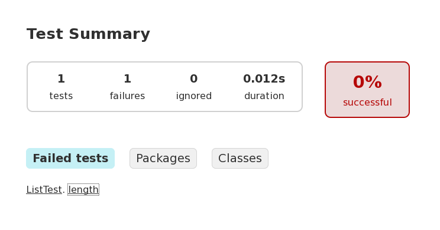
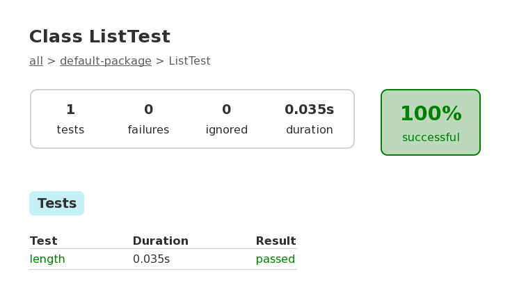

This repository contains code, exercises and solutions from the book "The Joy of Kotlin".

[![Build Status][badge-travis]][travis]

[badge-travis]: https://travis-ci.org/fpinkotlin/fpinkotlin.png?branch=master
[travis]: https://travis-ci.org/fpinkotlin/fpinkotlin

## How to use the project

The code is available as a Gradle project that may be used  by:

- Running Gradle commands in a terminal
- Importing in Eclipse (with limitations)
- Importing in IntelliJ

## Downloading the project

There are two ways to download this project. You may:

- Click on the _Download ZIP_ button on this page (https://github.com/pysaumont/fpinkotlin) to download a ZIP archive, then unzip it in the directory
of your choice
- Or you can clone the project using Git, in order to be able to update it easily when modifications or additions are made to the project. For this,
you will need to have Git installed on your PC and use the URL available on this page in the _SSH clone URL_ area.

## Importing into IntelliJ

IntelliJ offers the best support for Kotlin development, plus full Gradle integration. If you don't have IntelliJ, just download the Community version from https://www.jetbrains.com/idea/download. This free version has all you need for using the examples and solving the exercises in the book.

To import the project into IntelliJ:
 
 - open the _File_ menu and select _New_ > _Project from exisiting sources_. 
 
 - In the file chooser dialog box, select the _fpinkotlin-parent_ directory and click _OK_
 
 - in the new dialog box, check the _Import project from external model option_, select _Gradle_ and click _Next to get the following dialog box:
 

 
 - Click _Finish_ and wait stil import is complete

### Running a test

Each exercise as has a corresponding test that will fail until you implement a valid solution. To test you solution, simply run the corresponding test:

- Open the test file. For each exercise in the `src/main/kotlin` diretory, the test in the `src/test/kotlin` directory using the exact same package.

- Right click on the little green circle left to the class name an select _Run <test name>.

## Using Gradle to run the test

If you do not want to use IntelliJ, you can use any text editor to create an implementation for an exercise. Then you can run the corresponding test using Gradle from the command line. If you chose this solution, I suppose you will already have Gradle setup. If not, just download the current version from the Gradle site and install it.

### Running a single test

The command to use to run all tests with Gradle is:

    gradle test

However, this is not what you'll want since it would take to much time and it would run tests for exercises you have not solved yet, and these tests would fail.

Let's say you just solved `exercise01` in the `fpinkotlin-advancedlisthandling-exercises` module. The name of the test class is `ListTest`. To run this single test, use the following command:

    gradle :fpinkotlin-advancedlisthandling-exercises:test --tests com.fpinkotlin.advancedlisthandling.exercise01.ListTest

If the test fails, you will get something like:

    com.fpinkotlin.advancedlisthandling.exercise01.ListTest > ListTest.length FAILED
        java.lang.AssertionError
    
    1 test completed, 1 failed
    :fpinkotlin-advancedlisthandling-exercises:test FAILED
    
    FAILURE: Build failed with an exception.
    
    * What went wrong:
    Execution failed for task ':fpinkotlin-advancedlisthandling-exercises:test'.
    > There were failing tests. See the report at: file://<PATH_TO_PROJECT>/fpinkotlin-parent/fpinkotlin-advancedlisthandling-exercises/build/reports/tests/index.html

Fix your solution and try again.

On the other hand, if the test succeeds, you get something like:

    ...
    
    :fpinkotlin-advancedlisthandling-exercises:test
    
    BUILD SUCCESSFUL
    
    Total time: 15.67 secs

If you think some information is missing, I will agree. You can use the `--info` option to get a -little- lot more information:

gradle :fpinkotlin-advancedlisthandling-exercises:test --info --tests com.fpinkotlin.advancedlisthandling.exercise01.ListTest

    ...
    
    Successfully started process 'Gradle Test Executor 1'
    Gradle Test Executor 1 started executing tests.
    Gradle Test Executor 1 finished executing tests.
    Finished generating test XML results (0.029 secs) into: /media/KINGSTON2/fpinkotlin/fpinkotlin/fpinkotlin-parent/fpinkotlin-advancedlisthandling-exercises/build/test-results
    Generating HTML test report...
    Finished generating test html results (0.024 secs) into: /media/KINGSTON2/fpinkotlin/fpinkotlin/fpinkotlin-parent/fpinkotlin-advancedlisthandling-exercises/build/reports/tests
    :fpinkotlin-advancedlisthandling-exercises:test (Thread[main,5,main]) completed. Took 3.192 secs.
    
    BUILD SUCCESSFUL
    
    Total time: 16.222 secs

Here is the report for a failed test:

You may click on the test name to get detailed about what happened:

Once the problem is fixed, the test succeeds and you get the following report:

## Doing the exercises

For each chapter, you will find two modules called `chaptername-exercises` and `chaptername-solutions` . Go to the first exercise in
the `src/main/kotlin` hierarchy. Here, you will find some code with either a comment saying "To be implemented" or function(s) with the
implementation replaced with a single line throwing a runtime exception. Just implement the missing code.

Note that code is often duplicated from one exercise to the another, so you should not look at the code for exercise 2 before doing exercise 1,
since exercise 2 will often contain the solution to exercise one.

## Looking at solutions

If you don't find the correct solution to an exercise, you can look at the corresponding `chaptername-solutions` module. You may run the solution
test to verify that the solution is working.

## Remarks

Lots of code is duplicated. This is done so that all exercises are made as independent as possible. However, code reused from previous chapters
is copied to the `fpinjava-common` module and should be used from there.

## Module names

Code modules are generally named after the chapter titles, and not the chapter numbers, which sometimes make them difficult to find. Here is the list of the modules:

* Chapter 1: fpinkotlin-introduction

* Chapter 2: This chapter has no corresponding module

* Chapter 3: fpinkotlin-functions

* Chapter 4: fpinkotlin-recursion

* Chapter 5: fpinkotlin-lists

* Chapter 6: fpinkotlin-optionaldata

* Chapter 7: fpinkotlin-handlingerrors

* Chapter 8: fpinkotlin-advancedlisthandling

